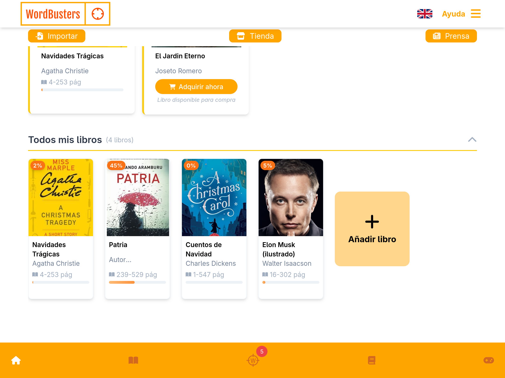
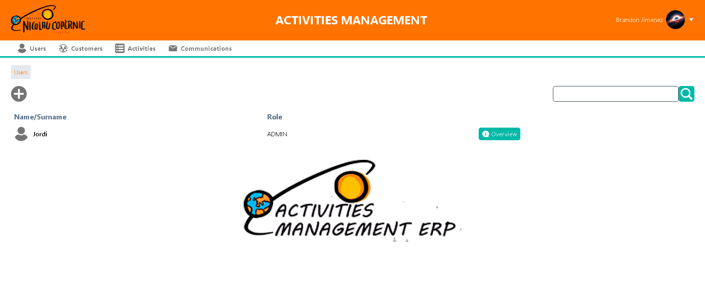

  

  <h2> Hello there, I'm Brandon Jiménez </h2>
  <h3>Full Stack Developer & Technical Lead</h3>

  
  

## 👨‍💻 About Me
Full Stack Developer with 1+ years of experience specializing in Java, Spring Boot, and React. Currently Technical Lead at WordBusters, leading a team of 5 junior developers in building a multilingual learning platform. Passionate about creating efficient backend systems and intuitive user interfaces.

## 🛠 Technical Skills

| Area               | Technologies |
|--------------------|--------------|
| **Languages**      |    |
| **Frontend**       |     |
| **Backend**        |   |
| **Databases**      |    |
| **DevOps & Cloud** |    |

## 🚀 Featured Projects

 <table> <tr> <td align="center"> <a href="https://github.com/BrandonJimenez23/EduExtra">   <strong>EduExtra – ERP for extracurricular management</strong> </a> 
Full-stack ERP platform for schools. Built with Spring Boot and React.
 </td> <td align="center"> <a href="https://github.com/BrandonJimenez23/WordBusters">   <strong>WordBusters – Language Learning Platform</strong> </a> 
Multilingual reader with WordReference API, team-led, Dockerized deployment.
 </td> </tr> <tr> <td align="center"> <a href="https://github.com/BrandonJimenez23/ERP-Java-Project">   <strong>ERP Java Project</strong> </a> 
ERP built in Java Swing as part of vocational training.
 </td> <td align="center"> <a href="https://github.com/PolNie/Sushi-Go-App">   <strong>Sushi Go – Android App</strong> </a> 
Find nearby Asian restaurants using geolocation. Built with Kotlin.
 </td> </tr> </table> 
 

## 📈 GitHub Stats

  
  

